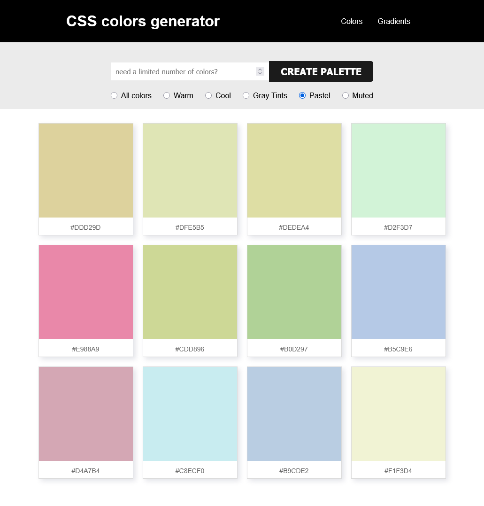
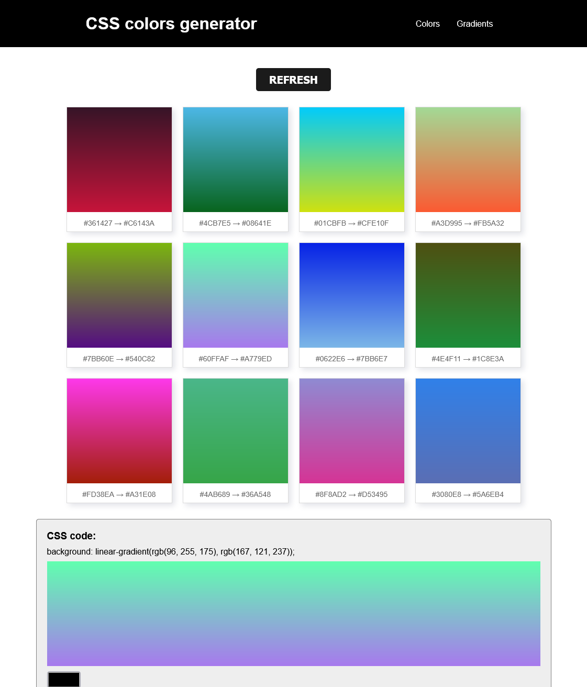

# COLOR generator app
Using JavaScript, HTML and CSS

I love to work with colors, and as a designer and artist, it is always useful to have a color generator when you need to work with limited number of colors, or when you need inspirations for new projects.

(This project is still in progress and I'm adding new functions)

## Implemented functions:
- You can generate a random palette of sRGB colors (by default is 12 colors, but you can choose a different number)
- you can copy each hexCode to save your fav colors
- You can chose between totally random sRGB colors, or by HSL hues! (muted, pastels, warm, cool...)
- You can create random gradients

